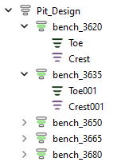
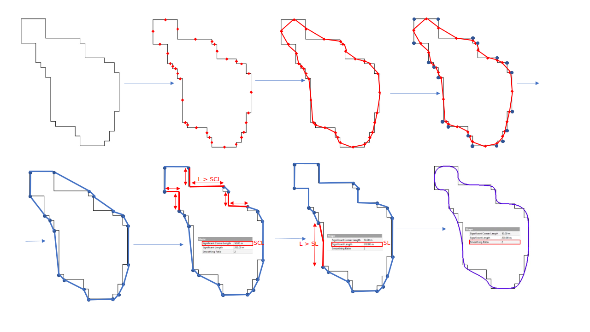
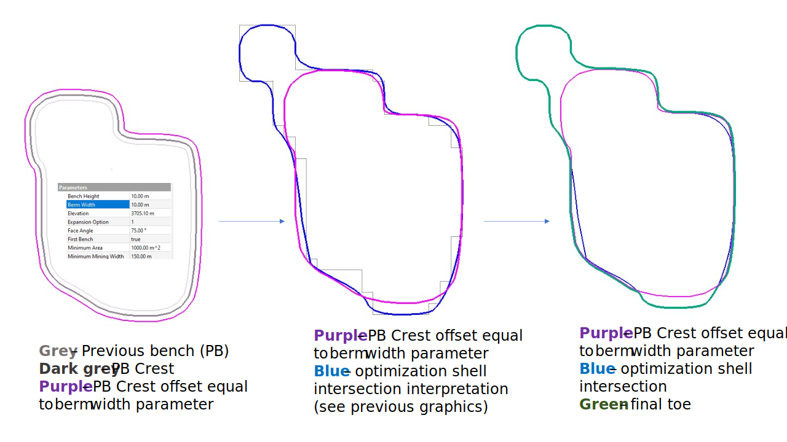
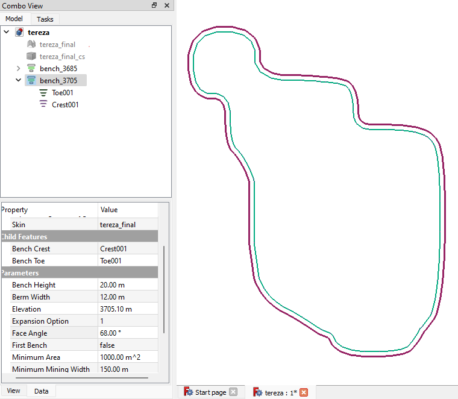
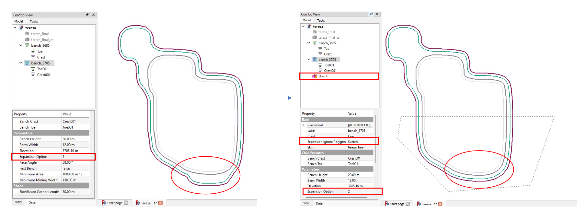
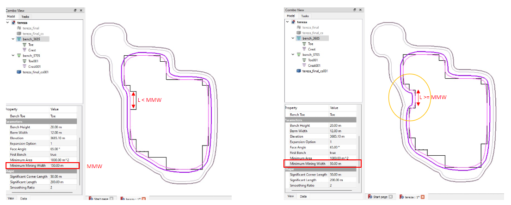

# **Parametric Pit Design (Toes and Crests)**

## **Overview**

The Surface Mine Design Workbench is a powerful tool for designing open-pit mines using parametric principles. This module focuses on generating an open-pit design based on specified parameters and input optimization results (e.g., ultimate pit shells). The design is **fully parametric**, meaning any updates to parameters or input shells are instantly reflected in the model. The algorithm efficiently handles large and complex shells, recalculating in under a second.

The following video demonstrates the system’s capability, where three pits seamlessly join to form an "internal dump" in the middle. This dump projects upward and inward while the rest of the pit expands outward and upward:

<video controls src="video/overview.mp4" title="Overview"></video>

https://github.com/user-attachments/assets/d3ee50f5-7dbd-4b38-a7b5-657ab3ef7270

The structure of the module is outlined below:

The key graphical features are **toes** and **crests**, while the **pit** and **bench** serve as container-like features. A **pit** consists of multiple **benches**, and each bench contains both a toe and a crest. To enhance usability, the parameters of toes and crests are aggregated at the bench level. For example, while the *minimum mining width* is a toe-specific parameter and the *face angle* applies to the crest, both are grouped together under the bench feature for easier parameter management.

<video controls src="video/structure_and_props.mp4" title="Structure and Properties"></video>

https://github.com/user-attachments/assets/934d9737-a67a-41b9-a1d3-e47823e636f4

This structure offers two key advantages:

- **Logical Organization**: Provides a clear hierarchy for design elements.
- **Parameter Propagation**: Parameters and visual settings can be propagated from parent features to child features. For example, setting a *minimum mining width* in the Pit feature will automatically propagate this value to all benches, while individual benches can override these settings as needed.

<video controls src="video/struck_and_props_example.mp4" title="Example of Structure and Properties"></video>

https://github.com/user-attachments/assets/5a51393b-d0da-4dca-a1a3-2df4b3fa522e

---

## **Toe Feature**

The **toe** is the most intricate feature in the workbench, forming the foundation for crest generation. Below is an overview of the **toe generation algorithm**:

1. **Intersection with Optimization Result**: Calculate the intersection of the optimization shell with the design.
2. **Midpoint Creation**: For each edge in the intersection, create a midpoint.
3. **Toe Vertex List (TVL)**:
   - Combine the midpoints into a closed polygon.
   - Append intersection vertices outside the polygon to the TVL.
4. **Shape Group Adjustments**: Add extra vertices to the TVL based on shape group parameters.
5. **Close Polygon**: Convert the TVL into a closed polygon to form the toe shape.

6. **Berm Width Adjustment**: For subsequent benches, unite the toe with the offset of the previous bench's crest to enforce the *minimum berm width* and maintain alignment with the optimization shell.
7. **Validation and Cleanup**: Remove redundant points and ensure geometry integrity.
8. **Visualization**: Instantiate the final toe geometry on the canvas.

---

## **Crest Feature**

The **crest** is simpler compared to the toe. It is generated as a vertical and horizontal offset of the bench toe, controlled by the following parameters:

- **Bench Height**: Sets the elevation difference between the toe and crest.
- **Face Angle**: Determines the slope of the crest.

The diagram below illustrates the crest generation process:

---

## **Bench Feature**

A **bench** acts as a container feature for a toe and crest, managing their parameters and visual settings. While it does not generate geometry itself, it is integral to organizing and controlling the design.

### **Key Attributes:**

- **Crest**: References the crest of the previous bench (if applicable).
- **Bench Toe and Bench Crest**: Links to the toe and crest features of the current bench.
- **Bench Height**: Controls the height difference between the current bench's crest and toe.
- **Berm Width**: Sets the horizontal offset of the crest from the toe.
- **Elevation**: Defines the elevation of the toe for the current bench.
- **Expansion Option**: Controls how the optimization shell impacts toe generation:
  - **Full Expansion**: Default option. Expands the bench entirely where the optimization shell width exceeds the berm width. (Node appears green in the data tree.)
  - **Partial Expansion**: Uses an external polygon to exclude certain areas from expansion. (Node appears green and purple.)
  - **No Expansion**: Ignores the optimization shell for toe generation. Useful for upper benches where the shell has minimal impact. (Node appears purple.)

- **Face Angle**: Controls the slope of the crest.
- **First Bench**: Boolean value indicating whether the bench requires input from a previous crest.
- **Minimum Area**: Filters out small polygons in the toe feature below a specified area.
- **Minimum Mining Width**: Ensures toe geometry maintains a minimum width.

### **Additional Parameters**

- **Significant Corner Length**
- **Significant Length**
- **Smoothing Ratio**

These parameters impact the toe geometry and are described in the toe generation algorithm.

---

## **Pit Feature**

The **pit** feature is a container for benches and manages their creation and arrangement. Key differences from the bench feature include:

- **No Elevation or Bench Height Parameters**: The pit feature defines a collection of benches, with individual elevations and heights specified via the **Bench Description** parameter.
- **Bench Description**: This parameter controls the number and arrangement of benches, using the following notation:
  - **Format**: `<StartElevation>,<EndElevation>,<BenchHeight>[;<StartElevation>,<EndElevation>,<BenchHeight>]`
  - Example: `"3620,3650,10"` creates 4 benches at elevations 3620, 3630, 3640, and 3650 with a height of 10 meters.
  - Example: `"3620,3650,10;3660,3670,5"` creates 4 benches at 10 meters followed by 2 benches at 5 meters.

---

This documentation describes the core functionality and structure of the Parametric Pit Design module, offering both flexibility and precision for open-pit mine planning.
